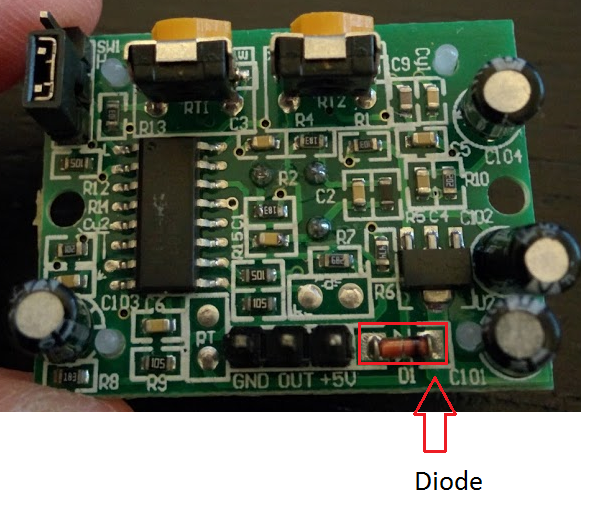

# RPiDayActivity

## Summary
A one or two hour hands on activity using a PIR motion sensor, Raspberry Pi, and Python code. Students create a simple motion sensor alarm that protects their pie (or other valuables). I designed the activity with beginners and kids in mind. The activity requires no soldering. The students don't need any programming knowledge. The instructor should be comfortable installing dependencies using the terminal, running python files within IDLE3, basic knowledge of the Raspberry Pi's GPIO ports. 

## Motivation

The San Diego Library Maker Lab asked me to "teach something with Raspberry Pis" for Pi Day. I wanted to do a hands on activity with both hardware and software. I was also promised pie.

## Getting Started


### Hardware List

1. Raspberry Pi with Raspbian installed. This guide was built using a Raspberry Pi 2, but it should work just fine with any flavor Raspberry Pi. 
1. HC-SR501 PIR motion sensor. [Amazon](http://www.amazon.com/s/ref=sr_nr_p_85_0?fst=as%3Aoff&rh=i%3Aaps%2Ck%3AHC-SR501%2Cp_85%3A2470955011&keywords=HC-SR501&ie=UTF8&qid=1458703999&rnid=2470954011)
1. Three Female to female jumper wires [Amazon](http://www.amazon.com/s/ref=nb_sb_noss_2?url=search-alias%3Daps&field-keywords=female+to+female+jumper)
1. Speaker to play alarm sounds. 
1. Pie (for eating... er I mean protecting)

## 1 - Installing utilities & transfer files 
**NOTE** You will be using the Terminal utility on the Raspberry Pi to install the utilities you need to play audio files. The Terminal utility comes preinstall with Raspbian. You can open from the desktop. 

###1.1 Install mpg123 MP3 player. 
We want to play an alarm sound. The mpg123 MP3 player will to this. 

Install mpg123 MP3 player. Type the following in the Terminal: 

		sudo apt-get install alsa-utils mpg123

You'll probably be prompted to continue. Press y for yes.
Next, reboot the Pi by typing sudo reboot

###1.2 Move the RPiDayActivityFiles directory to the Raspberry Pi. 
The RPiDayActivityFiles directory contains the following: 
1. PiAlarm.py - file to start the lesson with
1. PiAlarmComplete.py - example of a complete alarm.
1. Setup.py - function definitions and audio setup 
1. alarm.mp3 - alarm file 

## 2 - Lesson plan 


###2.1 Learn a little Python.

We will be writing code using IDLE3. Normally you might open IDLE3 by double clicking its icon; however, since we'll be using the GPIO ports we need to open IDLE3 using sudo. 
Open IDLE3 using the following in the terminal: 
		sudo idle3 

Open the PiAlarm.py file. 
Write all code under the first line that reads 
```python
from Setup import *
```
1. Task: Print “Hello World” to the console.
```python
print "Hello World" 
```
1. Task: Create a variable for your name and print it out.
```python
userName = "Rob"
print "Nice to meet you" + userName +"!" 
```
1. Task: Asked the user for their name. 
```python
userName = "Rob"
print "Nice to meet you" + userName +"!" 
```
1. Task: Ask the user to enter their name
```python
userName = input("Hello, I’m an RPi! What’s your name?")
print "Nice to meet you ” + userName “!”
```
1. Task: Using a loop ask the user to enter their name repeatedly 
```python
while (True):
	userName = input("Hello, I’m an RPi! What’s your name?")
	print "Nice to meet you ” + userName “!”
```

1. Task: Using a loop ask the user to enter their name repeatedly, but sound the alarm everytime they enter their name. 
**NOTE** The speaker needs to be on and plugged into the Pi. 
```python
while (True):
	userName = input("Hello, I’m an RPi! What’s your name?")
	print "Nice to meet you ” + userName “!”
	SoundTheAlarm()
	time.sleep(4)
```

###2.2 Attach the PIR sensor
**NOTE** The following instructions attached the signal from the PIR sensor to pin 23. 

1. Task: Attach the PIR sensor to the Raspberry Pi
The HC-SR501 PIR motion sensor takes in 5V and outputs 3.3V. I noticed that sometimes the pins aren't labeled on the sensor. In that case pin closest to the diede is the input. The middle pin is always the output. The remaining pin is ground. 



1. Task: Print "No Motion" when no motion is dectected and "Motion Detected" when motion is detected 
```python
while (True):
    if CheckForMotion(23)== False:
        print ("No Motion")
    else:
        print ("Motion Detected")
    time.sleep(1)
```

1. Task: Sound the alarm when motion is detected. 
```python
while (True):
    if CheckForMotion(23)== False:
        print ("No Motion")
    else:
        print ("Motion Detected")
        SoundTheAlarm()
        time.sleep(4)
    time.sleep(1)
```

## Contributors

+ Rob Burkhead - Creator 
+ Uyen Tran - Co-teacher and Emerging Technologies Librarian at the San Diego Central Library

## License

MIT. 


